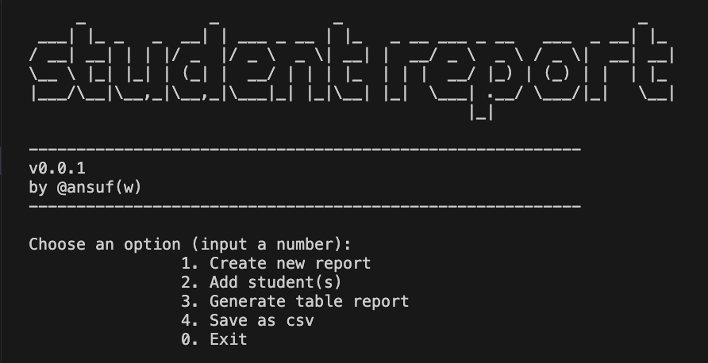

```  _             _            _                               _
 ___| |_ _   _  __| | ___ _ __ | |_   _ __ ___ _ __   ___  _ __| |_
/ __| __| | | |/ _  |/ _ \  _ \| __| |  __/ _ \  _ \ / _ \|  __| __|
\__ \ |_| |_| | (_| |  __/ | | | |_  | | |  __/ |_) | (_) | |  | |_
|___/\__|\__,_|\__,_|\___|_| |_|\__| |_|  \___| .__/ \___/|_|   \__|
                                              |_|

-------------------------------------------------------------------
v0.0.1
by @ansuf(w)
-------------------------------------------------------------------
```

# Student Report

cli-based application for generating student's grade

## Prerequisites

1. Go programming language (just it)


## How to use

1. clone this repo `git clone https://github.com/ansufw/student-report.git`

2. from terminal, change directory to project folder and run `go run .`




